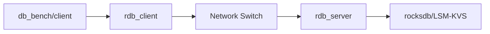

# Network-Based Service for RocksDB

This plugin provides a network-based service for RocksDB. It allows you to access RocksDB over the network using a simple protocol. The service is implemented using gRPC.

## Building

1. Install the gRPC C++ library. You can find instructions [here](https://grpc.io/docs/languages/cpp/quickstart/).
2. Build RocksDB with the plugin. From ROCKSDB Home directory:
    ```bash
    mkdir build
    cd build
    cmake -DROCKSDB_PLUGINS="netservice" -DWITH_NETSERVICE=ON  ..
    make
    ```
3. The plugin will be built in the `build` directory. Run `./rdb_server` on the server side (note on nomenclature in Design section below) and refer `examples/simple_grpc_example` for accessing this 'server'.

> Command I use: `cmake -DROCKSDB_PLUGINS="hdfs netservice" -DROCKSDB_BUILD_SHARED=OFF -DWITH_EXAMPLES=ON -DCMAKE_BUILD_TYPE=RelWithDebInfo -DWITH_TESTS=OFF -DWITH_NETSERVICE=ON ..`

<!-- Design -->
## Design

The rdb_client code is the library that is to be accessed by the client (db_bench) to access the RocksDB service. The rdb_server code is the server that listens for requests from the client and processes them. Contrary to traditional noemnclature, here, there can be multiple servers for a single client. This nomenclature needs to be updated in the future to something more intuitive. It currently neither suits the traditional client-server model nor the RocksDB model. Suggestions for improvement are: 
- Rename rdb_client to rdb_client_lib, Rename rdb_server to rdb_server_lib
- Alteratively, rename rdb_client to **client_egress**, rename rdb_server to **rocksdb_ingress**

<!-- A mermaid figure to demonstrate the system -->
